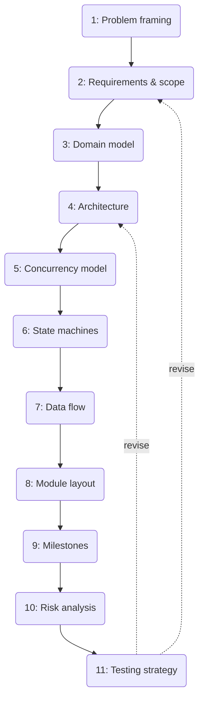

# The Planning Pipeline

This chapter is the checklist version of [Why Plan At All](./why-plan.md). Use it as a template for any new project — including ones nothing like a torrent client.

## The eleven steps

1. **Problem framing** — one paragraph: who, what pain, why now. No design yet.
2. **Requirements & scope** — functional requirements (must do), non-functional requirements (perf, reliability, portability), and an explicit non-goals list.
3. **Domain model** — the nouns of the system and their relationships, independent of code structure. This is "what do we need to represent," not "what struct do we write."
4. **Architecture** — the boxes (components/processes/crates) and arrows (protocols/calls) between them. This is the first diagram most people reach for, but note it's step 4, not step 1 — you need scope and domain settled first or the boxes are guesses.
5. **Concurrency model** — what runs in parallel, what's sequential, what owns shared state and how it's synchronized. Especially important in Rust, where the borrow checker will *force* this decision on you one way or another — better to make it deliberately.
6. **State machines** — for every entity with a lifecycle (a connection, a download, a job), enumerate its states and legal transitions before writing the code that mutates it.
7. **Data flow** — pick your 2-3 most important end-to-end scenarios and trace data through the architecture for each, as a sequence diagram. This is where architectural gaps get caught, because a box that "obviously" should exist often turns out to have no clear message going into or out of it.
8. **Module/crate layout** — now, and only now, map the architecture onto actual source files/crates/modules. Premature module layout before the architecture is settled causes churn.
9. **Milestones & sequencing** — order the work into independently demoable vertical slices. Each milestone should produce something you can run and show, not "50% of the parser."
10. **Risk analysis** — what's most likely to blow up the schedule or the design (usually: the part you understand least, or the part with an external dependency you don't control).
11. **Testing strategy** — how each layer gets verified: unit tests for pure logic, integration tests for protocol correctness, and a manual/e2e check for the full happy path.

## It's a loop, not a waterfall

The dotted "revise" arrows matter. While doing step 7 (data flow) for the torrent client, you'll commonly discover the architecture from step 4 is missing a component (this happens for real in Part II — tracing data flow surfaces the need for a piece manager that step 4 didn't call out explicitly enough). When that happens, go back, fix the earlier artifact, and move forward again. The artifacts are cheap to edit — that's the entire point of writing them down before code.

## How much time to spend

Roughly: enough that you could hand steps 1-9 to another competent engineer (or an AI agent) and get back something architecturally compatible with what you had in mind, without them asking you the same clarifying question twice. If you can't imagine that happening, the plan isn't done yet, no matter how much code you've already written.
