# The Planning Toolkit

A small set of diagram and document types covers almost every planning need. You don't need all of them for every project — pick the ones that answer a real open question.

## Diagram types and when to reach for each

| Diagram | Answers | Mermaid type |
|---|---|---|
| Context / architecture diagram | "What are the major components and how do they talk?" | `flowchart` |
| Sequence diagram | "In what order do these components exchange messages for one scenario?" | `sequenceDiagram` |
| State machine | "What states can this entity be in, and what triggers a transition?" | `stateDiagram-v2` |
| Entity-relationship diagram | "What are the core data structures and how do they relate?" | `erDiagram` |
| Class diagram | "What are the concrete types/structs and their fields/methods?" | `classDiagram` |
| Gantt / timeline | "In what order and over what time do we build this?" | `gantt` |
| Pie chart | "What's the relative weight/split of a fixed set of things?" | `pie` |
| Mind map | "What are all the sub-concerns of one big fuzzy topic, before it's structured?" | `mindmap` |
| User journey | "What does one *user* experience across time, including how they feel?" | `journey` |

A rule of thumb: if you can't decide which diagram to draw, you probably don't understand the question yet. Write a sentence describing what you're trying to decide, then pick the diagram that visualizes that sentence.

Below, each type gets: the question it answers, a minimal worked example, when to reach for it, and when *not* to — because picking the wrong diagram for a question is a common way to produce a pretty picture that answers nothing.

---

## `flowchart` — components and relationships

**Question:** "What are the pieces, and what talks to what?"

`flowchart` is the general-purpose box-and-arrow diagram — good for architecture diagrams, data-flow-at-a-glance, and decision trees. Direction (`TB` top-bottom, `LR` left-right) and `subgraph` grouping are the two features that do most of the work.

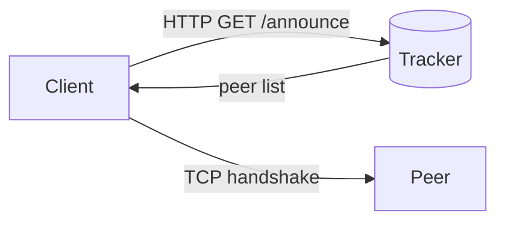

- Node shapes carry meaning by convention: `[Rectangle]` for a process/component, `(Rounded)` for a start/end, `[(Cylinder)]` for a datastore or external system, `{Diamond}` for a decision.
- `subgraph` lets you show internal grouping (e.g. "everything inside our process" vs. "external systems") without a separate diagram — see [System Architecture](../part2/04-architecture.md) for a real one with three subgraph-free external cylinders.
- **Use for:** architecture/context diagrams, one-time decision trees, dependency graphs (like the crate graph in [Module Layout](../part2/08-module-layout.md)).
- **Don't use for:** anything with *time ordering* between specific messages (that's a `sequenceDiagram`) or anything with *states and transitions on one entity* (that's a `stateDiagram-v2`). A flowchart with arrows labeled `1.`, `2.`, `3.` is usually a sequence diagram wearing a disguise — switch types.

---

## `sequenceDiagram` — one scenario, in order, across participants

**Question:** "For this one scenario, what messages fly between which participants, in what order?"

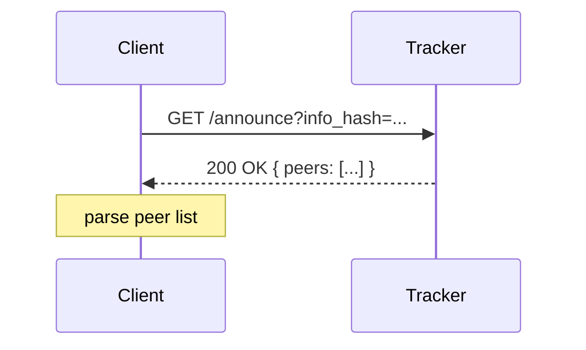

- `->>` is a request/call, `-->>` is a response/return — keeping this distinction consistent makes long diagrams readable at a glance.
- `Note over X` documents *why*, not just *what* — use it for the non-obvious reasoning step, same rule as code comments.
- `alt`/`else`/`opt`/`loop` blocks model branching and repetition within one scenario — see the hash-mismatch branch in [Data Flow](../part2/07-data-flow.md) scenario 2.
- **Use for:** tracing 2-3 *specific, named* scenarios end-to-end through an architecture you've already drawn as a flowchart — this is how you catch missing arrows/components, because a message with no sender or receiver in the diagram means a component is missing from the architecture.
- **Don't use for:** describing *all possible* orderings of messages for an entity — once you're drawing more than 2-3 branches deep, you actually want a state machine instead, because you're really enumerating states and legal transitions, not a single scenario.

---

## `stateDiagram-v2` — one entity's lifecycle

**Question:** "For this one entity, what states can it be in, and what specific event causes which transition?"

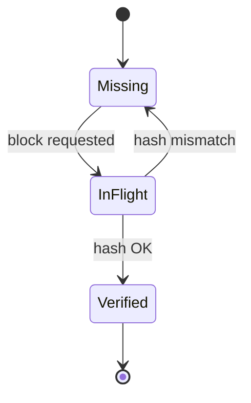

- `[*]` is the pseudostate for "doesn't exist yet" / "done, discarded" — always start and end here so the diagram shows the *whole* lifecycle, not just the interesting middle.
- Label every arrow with the **event or condition**, not a description of the state you're leaving — "hash mismatch" tells you what causes the transition; "verifying" (a state name) does not.
- Nested/composite states (`state Ready { ... }`) are supported for sub-states, but reach for them only when a sub-state genuinely has its own transitions worth showing — otherwise it's noise.
- **Use for:** any entity that a bug tracker would call "has a status field" — connections, jobs, orders, downloads, pieces (see [State Machines](../part2/06-state-machines.md)). If you find yourself writing `if state == X && other_flag` in a code review, that's a sign a state machine should have been drawn first, and possibly that two independent flags got conflated into one state name (the choke/interest example in that chapter).
- **Don't use for:** system-wide component interaction (too fine-grained a lens — go back to `flowchart`) or timing/ordering across *different* entities (that's `sequenceDiagram`).

---

## `erDiagram` — data shapes and relationships

**Question:** "What are the nouns, their key attributes, and how do they relate — one-to-one, one-to-many, many-to-many?"

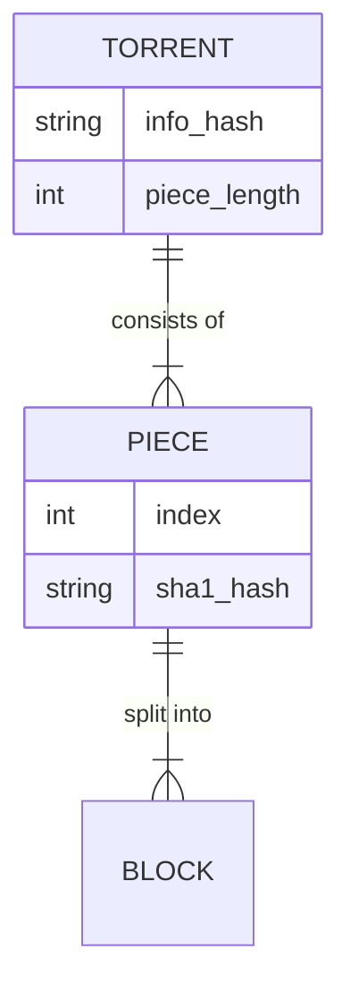

- Crow's-foot notation carries real information: `||--||` one-to-one, `||--o{` one-to-zero-or-many, `||--|{` one-to-one-or-many. Getting this right up front avoids an accidental `Vec<T>` where a single `T` was intended, or vice versa.
- The `{ }` attribute blocks are optional — add them only for entities whose *fields* are themselves part of the open question (e.g. "does Torrent need a separate `announce_list` from `announce`?"). Don't turn every ER diagram into a full schema dump; that's what the code is for.
- **Use for:** the domain-model step, before architecture — see [Domain Model](../part2/03-domain-model.md). Also useful for literal database schema planning if your app has one.
- **Don't use for:** behavior or lifecycle (a `Piece` having states is a `stateDiagram-v2` concern layered on *top* of the `PIECE` entity defined here, not a replacement for it).

---

## `classDiagram` — concrete types, fields, and methods

**Question:** "What are the actual structs/classes, their fields, their methods, and their type relationships (inheritance, composition, trait implementation)?"

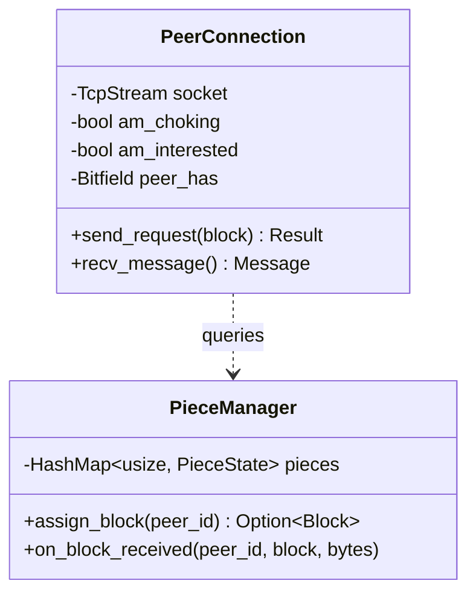

- This is the diagram closest to actual code — visibility markers (`+public`, `-private`), typed fields, typed method signatures. It's most valuable in statically-typed languages (Rust, Java, TypeScript, C++) where these distinctions are enforced by the compiler, not just convention.
- Because it's close to code, it's also the diagram that goes stale fastest. Draw it late (after architecture and module layout are settled — see [Module Layout](../part2/08-module-layout.md)) and only for the handful of types whose shape is genuinely a design decision worth reviewing, not for every struct in the codebase.
- **Use for:** nailing down a tricky type's public API before writing it (e.g. "should `PeerConnection::send_request` take a `Block` or an `(usize, usize, usize)` tuple?" — draw it, and the ugliness of the tuple version becomes obvious).
- **Don't use for:** whole-codebase documentation — it will be wrong within a week and nobody will trust it. Prefer generated docs (`cargo doc`, `rustdoc`) for that; reserve hand-drawn class diagrams for a small number of genuinely load-bearing types.

---

## `gantt` — sequencing and time

**Question:** "In what order, and over roughly what span, do we build this?"

```mermaid
gantt
    dateFormat  X
    axisFormat %s
    section Core
    Bencode parser        :a, 0, 2
    Torrent parsing        :b, after a, 2
    section Network
    Tracker announce       :c, after b, 2
    Peer wire protocol      :d, after c, 3
```

- `dateFormat X` / `axisFormat %s` (used throughout this book) treats the axis as plain relative units ("days of effort") instead of real calendar dates — appropriate when you're sequencing *milestones*, not committing to a calendar the reader will hold you to. Switch to real dates only once you actually have a deadline-driven schedule.
- `after <id>` dependencies are the whole value of this diagram over a plain bullet list — they force you to say explicitly what blocks what, which is exactly the sequencing logic in [Milestones & Sequencing](../part2/09-milestones.md).
- **Use for:** milestone ordering, showing what's parallelizable vs. strictly sequential.
- **Don't use for:** anything without a dependency structure worth showing — if every item is just "and then, and then, and then" with no real parallelism or blocking relationship, a numbered list is more honest and less work to maintain.

---

## `pie` — proportions of a fixed whole

**Question:** "Of a fixed set of things, what's the relative share of each?"

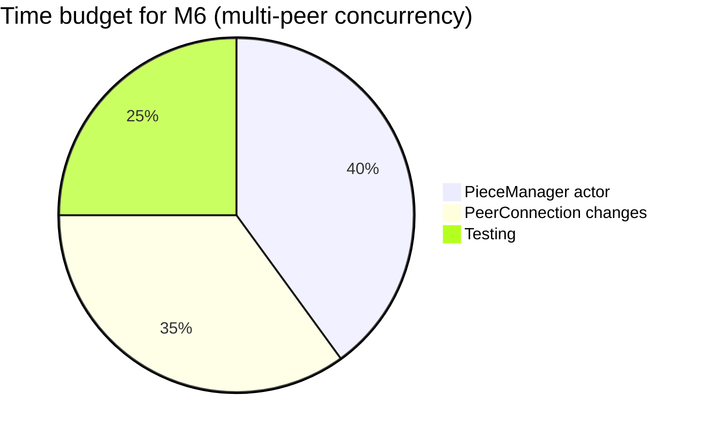

- Rarely central to a plan, but genuinely useful for things like "where did the last sprint's time actually go," "what fraction of bug reports are protocol-parsing vs. networking vs. disk," or communicating a resourcing split to stakeholders.
- **Use for:** retrospective/proportional reporting, not upfront design decisions.
- **Don't use for:** more than ~5-6 slices (unreadable), or anything that isn't truly parts-of-a-whole (don't use it to compare unrelated magnitudes — that's what a bar chart, not covered by Mermaid directly, is for).

---

## `mindmap` — unstructured brainstorm before you know the structure

**Question:** "What are all the things I should even be thinking about here?" — asked *before* you know whether those things are components, risks, requirements, or something else.

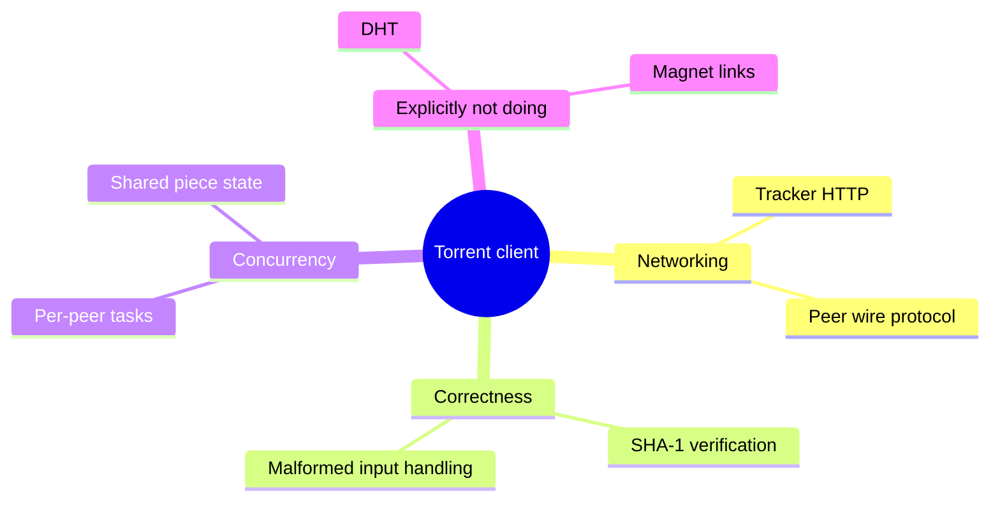

- This is the one diagram type meant to be **messy and pre-structural** — a dumping ground for step 1-2 thinking (problem framing, requirements) before you sort items into "requirement," "risk," "non-goal," etc.
- **Use for:** the very first messy brainstorm, alone or with a team, before committing to any of the other diagram types.
- **Don't use for:** anything you intend to keep updating long-term — a mind map has no notion of relationship type or direction, so it can't express "depends on" or "causes." Once the brainstorm is sorted, throw the mind map away and let its contents become entries in the real artifacts (requirements list, risk table, domain model).

---

## `journey` — one user's experience over time

**Question:** "What does a specific user go through, in order, and how do they feel about each step?"

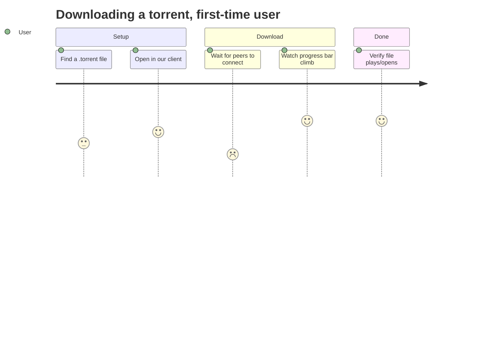

- The 1-5 score per step is subjective (satisfaction/friction), which is exactly the point — it's the one diagram type in this toolkit whose subject is a *human's experience*, not the system's internals.
- **Use for:** CLI/UX-facing tools where "does this feel slow/confusing at step 3" is a real design question — e.g. deciding that a bare progress percentage isn't enough and you also need a peer count and speed readout (see F10 in [Requirements & Scope](../part2/02-requirements.md)).
- **Don't use for:** backend-only components with no direct human interaction — there's no "user" for a `PieceManager`, so there's no journey to draw.

---

## Choosing fast: a decision guide

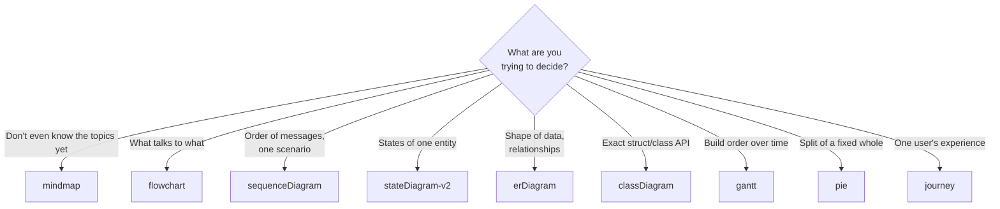

## Document types

- **Problem framing** (half a page): who has this problem, what do they do today without your software, why does that fall short.
- **Requirements & scope**: a bullet list of "must do," a bullet list of "explicitly will not do." The second list is as important as the first.
- **Architecture doc**: the context diagram plus one paragraph per box explaining its responsibility and *what it does not do*.
- **Risk register**: a table of (risk, likelihood, impact, mitigation). Forces you to think about failure before it happens in production.
- **Milestone plan**: an ordered list of vertical slices, each one independently demoable.
- **`CLAUDE.md` / `AGENTS.md`**: durable instructions for an AI assistant working in this repo — conventions, constraints, things not to do. Covered in Part III.
- **`PROGRESS.md`**: a living log of what's done, what's in flight, what's next. Covered in Part III.

## A note on tooling

This book uses [mdBook](https://rust-lang.github.io/mdBook/) with the [mdbook-mermaid](https://github.com/badboy/mdbook-mermaid) preprocessor so diagrams live as text in Markdown, next to the prose that explains them, versioned in the same repo as the code. That's a deliberate choice: diagrams that live in a separate wiki or a Google Doc rot, because nobody updates them when the code changes. Diagrams-as-code next to the code get updated in the same PR.

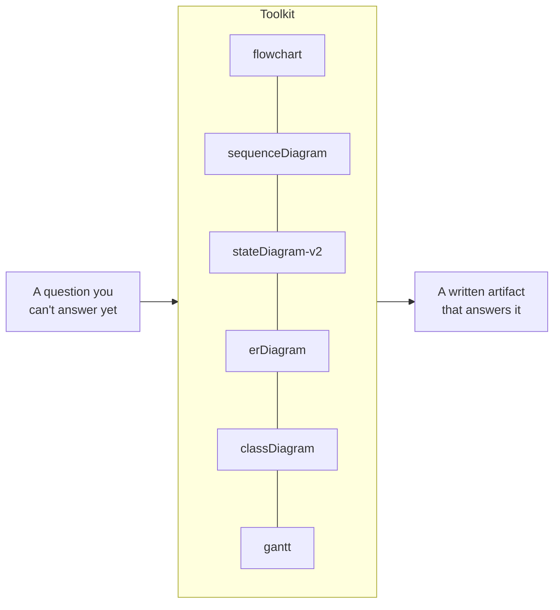
