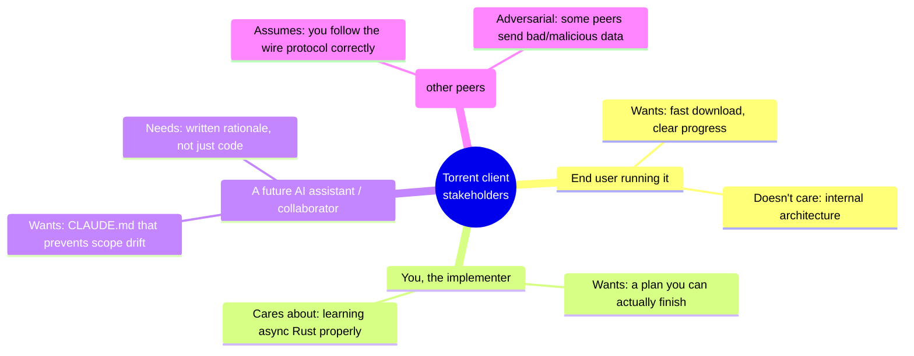

# Problem Framing

Every plan starts with a paragraph, not a diagram. Resist the urge to draw boxes yet.

## Who has this problem

Someone has a `.torrent` file (or a magnet link) and wants the file(s) it describes, downloaded efficiently by pulling pieces from many peers in parallel rather than one slow server.

## What they do today

They use an existing client (qBittorrent, Transmission, libtorrent-based tools). Those work fine — we are not solving an unsolved problem for the end user. We are solving it for *ourselves*, as a learning exercise, and the constraint that makes it interesting is:

> **We write only the client. The tracker already exists and is out of scope.**

That single sentence is a scope decision, and it already shapes everything downstream: we don't design a tracker's peer database, its scrape endpoint, or its storage. We only design the *client-side* of two protocols:

1. **Tracker protocol** (HTTP or UDP, per [BEP 3](https://www.bittorrent.org/beps/bep_0003.html) / [BEP 15](https://www.bittorrent.org/beps/bep_0015.html)) — client asks a tracker "who has this torrent," tracker answers with a peer list.
2. **Peer wire protocol** ([BEP 3](https://www.bittorrent.org/beps/bep_0003.html)) — client talks directly to other peers to exchange pieces of the file.

## Stakeholders and their concerns

Even a solo/learning project has more than one "stakeholder" once you separate the roles a person plays. Naming them up front avoids silently optimizing for one at the expense of another:

The "wider swarm" entry matters more than it looks — it's the seed of NF2 (resilience) in the next chapter and of most of the [Risk Analysis](./10-risks.md) table. Naming it here, in problem framing, means it isn't a surprise discovered mid-implementation.

## Why now / why this shape

Rust is chosen deliberately, not incidentally. That decision has consequences for the plan:

- No garbage collector, no shared mutable state without explicit synchronization — concurrency has to be **designed**, not incidentally handled by a runtime.
- Strong static typing is a gift for modeling protocol messages and state machines — invalid states can often be made unrepresentable.
- `async`/await via Tokio is the natural fit for "talk to dozens of peer sockets and one or more tracker endpoints concurrently."

## What "done" looks like, roughly

Before scope is formally written down (next chapter), it helps to have a rough, informal picture of success — a sanity check that later formal requirements will be measured against:

> Run `torrent-client some.torrent` on a real, reasonably healthy public-domain torrent (e.g. a Linux ISO). The client finds peers, downloads all pieces from more than one peer at once, verifies every piece, writes a byte-identical file to disk, and reports progress while doing it — without crashing no matter what a hostile or broken peer sends it.

Everything in the rest of Part II either builds toward this sentence or is explicitly named as *not* required to reach it (see the non-goals list in the next chapter).

## One-paragraph problem statement

> Build a Rust command-line BitTorrent client that, given a `.torrent` file, contacts the torrent's tracker(s) to discover peers, connects to those peers over the BitTorrent peer wire protocol, downloads the file's pieces in parallel from multiple peers, verifies each piece's integrity against the torrent's metadata, assembles the complete file(s) on disk, and (in a later milestone) seeds completed pieces back to other peers. Trackers are assumed to already exist and are treated as an external system we speak a protocol to, not something we build.

Keep this paragraph pinned somewhere visible (it becomes the opening of `CLAUDE.md` in Part III). Every later decision should be traceable back to it.
