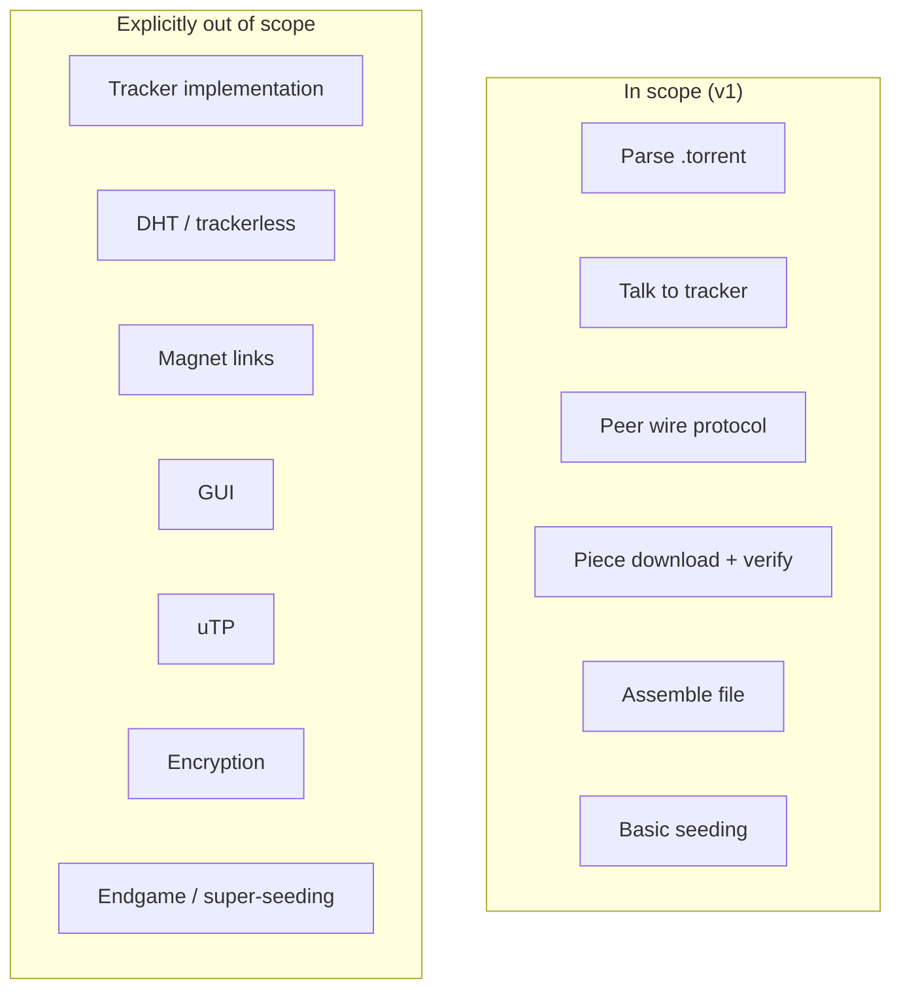

# Requirements & Scope

## Functional requirements (must do)

Each requirement gets an explicit **acceptance criterion** — the concrete, checkable condition that tells you when it's actually satisfied, not just "started."

- **F1. Parse a `.torrent` file** (bencoded metainfo): announce URL(s), piece length, piece hashes, file name(s) and length(s), info-hash.
  *Acceptance:* given a real `.torrent` file, the computed `info_hash` matches the known-good value published for that torrent, and every piece hash decodes to exactly 20 bytes.
- **F2. Contact the tracker** over HTTP(S) with a GET request (`info_hash`, `peer_id`, `port`, `uploaded`, `downloaded`, `left`, `event`), parse the bencoded response into a peer list.
  *Acceptance:* against a real tracker, receive and correctly parse a non-empty peer list, including the compact peer format (`ip:port` packed as 6 bytes each) alongside the older dictionary format.
- **F3. Perform the peer wire handshake** with a given peer (19-byte protocol string, 8 reserved bytes, 20-byte info-hash, 20-byte peer-id).
  *Acceptance:* handshake against a real peer succeeds (peer echoes back the same info-hash), and a handshake with a *mismatched* info-hash is correctly rejected without panicking.
- **F4. Exchange the base peer-wire messages:** `choke`, `unchoke`, `interested`, `not interested`, `have`, `bitfield`, `request`, `piece`, `cancel`.
  *Acceptance:* every message type round-trips through encode→decode in a unit test; a real peer's `bitfield` is correctly parsed into a per-piece boolean set.
- **F5. Track, per peer, which pieces they have** (from `bitfield`/`have` messages).
  *Acceptance:* a `have` message received after the initial `bitfield` correctly updates that one bit, not the whole map.
- **F6. Decide which pieces to request from which peers** (piece-selection strategy — start simple: rarest-first is the eventual goal, sequential is an acceptable first milestone).
  *Acceptance (v1/sequential):* pieces are requested in index order, never re-requesting an already-verified piece. *Acceptance (rarest-first, later):* given a known peer/piece-availability distribution, the client requests the least-replicated piece first.
- **F7. Download pieces from multiple peers concurrently.**
  *Acceptance:* with 5+ available peers, more than one peer has an in-flight request at the same time (observable via logging/metrics), and aggregate throughput is higher than the single-peer case.
- **F8. Verify each downloaded piece's SHA-1 hash** against the value in the torrent metadata; reject and re-request on mismatch.
  *Acceptance:* a deliberately corrupted block (test-injected) causes the piece to be discarded and re-requested, never written to disk.
- **F9. Assemble verified pieces into the final file(s)** on disk, supporting both single-file and multi-file torrents.
  *Acceptance:* for a multi-file torrent whose piece boundaries straddle a file boundary, both files end up byte-identical to the known-good originals.
- **F10. Report progress** (percent complete, download speed, peer count) to the user via CLI output.
  *Acceptance:* progress output updates at least once per second during an active download and reflects real verified-byte counts, not optimistic in-flight counts.
- **F11. (later milestone) Seed:** respond to peer requests for pieces we already have, once we have any.
  *Acceptance:* a second instance of our own client can complete a download using *only* our instance as its peer.

## Non-functional requirements

| ID | Requirement | Concrete target |
|---|---|---|
| NF1 | Concurrency | Handle at least 50 simultaneous peer connections without one slow/malicious peer measurably slowing the others (a stalled peer's task must not block the Tokio executor). |
| NF2 | Resilience | A peer disconnecting, timing out (default 120s no-data), or sending garbage never crashes the process or corrupts `PieceManager` state — only that peer's task exits. |
| NF3 | Correctness over speed | Piece-hash verification runs on 100% of pieces, always — there is no config flag to disable it, even for local/debug runs. |
| NF4 | Portability | Builds and runs on Linux and macOS with `cargo build`; no OS-specific syscalls (e.g. `io_uring`-only paths) in core logic — Tokio's portable APIs only. |
| NF5 | Resumability (stretch) | Restarting on a partially-downloaded file re-verifies existing pieces from disk and only re-downloads what's missing/invalid — not required for v1, but the piece-state model must not structurally prevent adding it. |

## Explicit non-goals (out of scope)

This list is as load-bearing as the requirements above it:

- **Writing a tracker.** Given, per the problem framing.
- **DHT (distributed hash table / trackerless torrents, BEP 5).** A real generalization, but adds an entirely separate peer-discovery subsystem. Out of scope for v1; the architecture should not preclude adding it later.
- **Magnet links.** These require fetching metadata from peers via the extension protocol (BEP 9) instead of reading it from a local `.torrent` file. Out of scope for v1 — we assume a `.torrent` file is already in hand.
- **A GUI.** CLI only.
- **µTP (uTorrent transport protocol).** We use plain TCP for peer connections. µTP is a UDP-based optimization, not required for correctness.
- **Peer encryption (MSE/PE).** Skipped for v1; some peers/swarms may refuse unencrypted connections, which is an accepted limitation, not a bug.
- **Bandwidth throttling / rate limiting.** Not required for correctness; can be added later without architectural changes.
- **Endgame mode tuning / super-seeding / other advanced swarm optimizations.** Real clients have many small algorithmic refinements beyond rarest-first; v1 stops at "correct and reasonably fast," not "state of the art."

## Priority (MoSCoW), for when time is short

If a milestone runs long, this is the order to protect vs. cut, expressed independent of the milestone sequencing in [Milestones & Sequencing](./09-milestones.md):

- **Must have:** F1–F5, F8, F9, NF2, NF3 — without these there is no correct downloader at all.
- **Should have:** F6 (at least sequential), F7, F10.
- **Could have:** F6 (rarest-first specifically), F11, NF5.
- **Won't have (this version):** everything in the non-goals list above.

## Why the non-goals list matters here specifically

Every one of DHT, magnet links, and encryption is something a "real" BitTorrent client has. Writing them down as *explicitly deferred* — rather than silently never doing them — means that when you (or an AI assistant helping you) are three milestones in and tempted to "just quickly add DHT support," the scope doc is there to say: that's a new project phase, not a quick add, and here's why.

