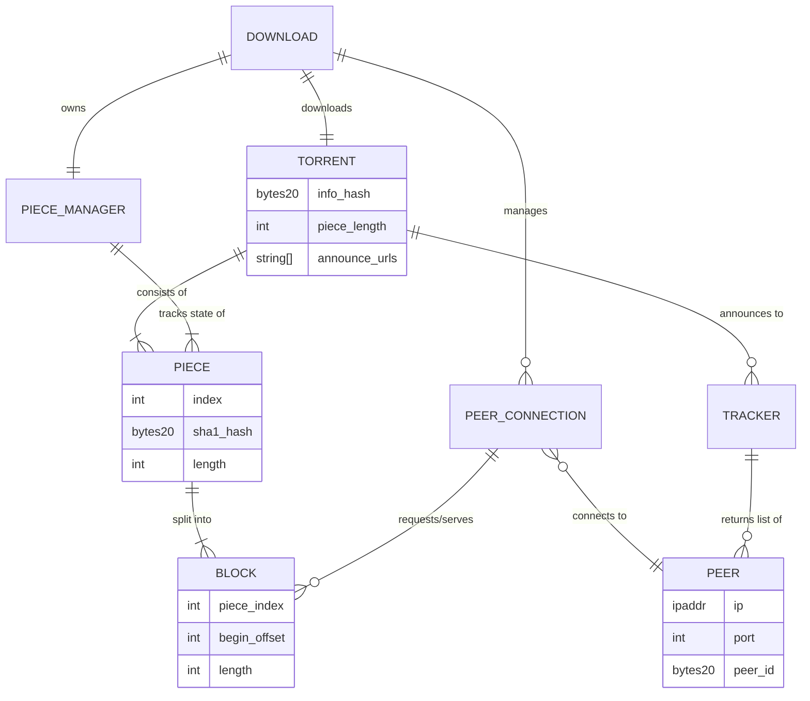

# Domain Model

Before any code structure, write down the *nouns* — the concepts the system reasons about — and how they relate. This is deliberately independent of Rust syntax at first, but by the end of this chapter we do sketch the concrete types, because in a statically-typed language the domain model and the type design converge quickly — that convergence is worth showing, not hidden until [Module Layout](./08-module-layout.md).

## The core nouns

- **Torrent** — the parsed metainfo: info-hash, piece length, list of piece hashes, file layout (single or multi-file), announce URL(s).
- **Piece** — a fixed-size chunk of the total file data (commonly 256KB–4MB), identified by index, with a known SHA-1 hash. The unit of *verification*.
- **Block** — a sub-chunk of a piece (commonly 16KB), the unit actually *requested* over the wire. A piece is downloaded as several blocks, possibly from different peers.
- **Peer** — a remote endpoint (IP:port) participating in the swarm, identified by a 20-byte peer-id once handshaked.
- **PeerConnection** — the live, stateful TCP connection to a given Peer: its choke/interest state (both directions), its known bitfield of pieces, in-flight requests.
- **Tracker** — an external announce endpoint we send requests to and get peer lists back from. (Implementation is out of scope; the client-side protocol is not.)
- **Swarm** — the set of all Peers/PeerConnections currently known for one Torrent.
- **PieceManager / PieceStore** — the component owning the authoritative record of which pieces are: not-started, in-progress (and from whom), verified-complete.
- **Download** — the overall session: one Torrent + one Swarm + one PieceManager + progress stats, from start to either completion or cancellation.

## Relationships



## Why `Piece` and `Block` are separate nouns

This is the single most common modeling mistake newcomers make: treating "piece" as the unit of network transfer. It isn't. The wire protocol's `request`/`piece` messages operate on **blocks** (typically 16KB) because a multi-megabyte piece sent as one message would let one slow peer stall an entire buffer and makes cancellation/pipelining impossible. But **verification** (the SHA-1 hash in the torrent metadata) applies to the whole **piece**, assembled from all its blocks. Two different units for two different concerns — get this wrong in the domain model and it leaks into an awkward `PieceManager` API later.

Concretely, for a 4MB piece and 16KB blocks, that's **256 blocks per piece** — a number worth internalizing now, because it's the reason a naive "track completion as a percentage" design breaks down: you need to know *which specific 16KB ranges* are still missing, not just "73% of this piece is done."

## Peer-visible state vs. our-state

A subtlety worth naming now because it drives the state machine in a later chapter: for every `PeerConnection` there are actually **four** independent boolean flags, not one "connection state":

- am I choking them?
- am I interested in them?
- are they choking me?
- are they interested in me?

Modeling this as a single enum ("connected", "choked", "interested") is a common mistake — the protocol is explicitly bidirectional and asymmetric. The domain model should carry all four flags per connection from day one.

## From nouns to types: a first sketch

This is deliberately a *sketch*, not final code — but writing it now, right after the ER diagram, is how you catch a mismatch between the conceptual model and what Rust will actually let you express cleanly.

```rust
pub struct InfoHash(pub [u8; 20]);
pub struct PeerId(pub [u8; 20]);

pub struct Torrent {
    pub info_hash: InfoHash,
    pub piece_length: u32,
    pub piece_hashes: Vec<[u8; 20]>,   // one SHA-1 per piece, in order
    pub files: FileLayout,
    pub announce: Vec<String>,
}

pub enum FileLayout {
    Single { name: String, length: u64 },
    Multi { dir_name: String, files: Vec<(String, u64)> },
}

// A block is identified relative to its piece — deliberately NOT a global
// byte offset, so piece-level code never needs to know total file size.
pub struct BlockId {
    pub piece_index: u32,
    pub begin: u32,
    pub length: u32,
}

pub enum PieceState {
    Missing,
    InFlight { have_bytes: Vec<Option<Bytes>> },  // one slot per block
    Verified,
}
```

Two design decisions worth calling out because they came directly from the domain model, not from Rust idiom:

- `BlockId` is piece-relative (`piece_index` + `begin` within that piece), matching the wire protocol's own `request` message fields exactly — no translation layer needed between "what the domain model calls a block" and "what goes on the wire."
- `PieceState::InFlight` carries a `Vec<Option<Bytes>>` — one slot per block, `None` until received — which is the direct type-level expression of the "many blocks make one piece, verification only happens once all are present" rule from the previous section.

## A note on why this chapter still matters even in a strongly-typed language

You might ask: if Rust's type system will force these decisions anyway, why write the domain model in prose/diagrams first? Because the diagram is *cheaper to redraw* than the code is to refactor. Getting `Piece`/`Block` conflated, or the four choke/interest flags collapsed into one enum, costs an ER-diagram edit if caught here — it costs touching every module that used the wrong shape if caught after [Module Layout](./08-module-layout.md) is written.
