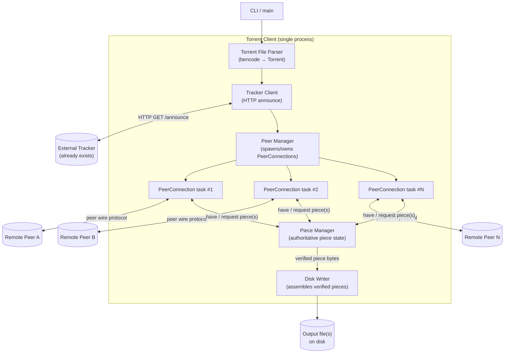
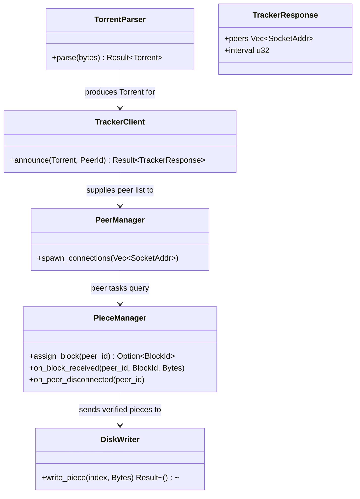

# System Architecture

With scope and domain settled, we can draw the boxes. Each box below is a *component*, not necessarily a separate process — in a single-binary Rust client most of these are modules/tasks within one program, communicating via async channels, not IPC.

## Component responsibilities (and non-responsibilities)

- **Torrent File Parser** — turns raw bencoded bytes into a typed `Torrent` struct. Does *not* talk to the network.
- **Tracker Client** — owns the announce/re-announce loop, builds the tracker request, parses the response. Does *not* decide piece strategy — it only reports "here are peers."
- **Peer Manager** — owns the set of `PeerConnection` tasks: connects to new peers as the tracker supplies them, replaces dead ones, enforces a max-connections cap. Does *not* itself speak the wire protocol.
- **PeerConnection (one per peer, concurrent)** — owns one TCP socket, does the handshake, decodes/encodes wire messages, tracks the four-flag choke/interest state (see [Domain Model](./03-domain-model.md)) and this peer's known bitfield. Does *not* decide *which* piece to request — it asks the Piece Manager.
- **Piece Manager** — the single source of truth for piece state (not-started / in-flight / verified). Decides piece/block selection strategy, hands out block requests to whichever `PeerConnection` asks, verifies SHA-1 on completed pieces. This is the most important box in the diagram — nearly every subtlety in the project (rarest-first selection, endgame mode, re-requesting from a different peer on timeout) lives here.
- **Disk Writer** — takes verified piece bytes and writes them at the correct file offset(s), correctly handling multi-file torrents where a piece may span a file boundary.

## Why this shape and not another

An easy wrong instinct is "one task per piece" instead of "one task per peer connection." That inverts the natural unit of I/O: a **peer connection** is a genuine stateful, long-lived network resource (a TCP socket) — it deserves a task. A **piece** is just data with a state; it doesn't need its own task, it needs an entry in a shared table (`PieceManager`) that any peer-connection task can query and update. This mapping — long-lived I/O resource → task, everything else → shared state behind a manager — is a reusable heuristic, not specific to torrents.

## Alternatives considered and rejected

Writing down what you *didn't* pick, and why, is as valuable as the diagram of what you did — it stops the same alternative from being re-litigated every few weeks with no new information.

| Alternative | Why it looked tempting | Why rejected |
|---|---|---|
| One OS thread per peer (no async runtime) | Simpler mental model, no `async`/`.await` learning curve | Doesn't scale past a few dozen peers (thread stacks, context-switch cost); Tokio tasks are far cheaper and this is explicitly a project about doing the async version properly |
| `Arc<Mutex<PieceManager>>` shared directly by all peer tasks | Fewer moving parts than an actor + channels | Spreads lock-acquisition reasoning across every call site instead of confining it to one task; higher deadlock/contention risk as piece-selection logic grows in M7 (see [Concurrency Model](./05-concurrency.md)) |
| One task per piece instead of per peer connection | "Pieces are the unit of work, why not?" | Pieces aren't I/O resources — no socket, no inherent concurrency need; would require its own synchronization to hand pieces between peer connections, reinventing what `PieceManager` already does |
| Single big `match`-based event loop, no tasks at all | Avoids concurrency entirely | Can't service multiple peer sockets without manual multiplexing (reinventing what Tokio's task scheduler already does well); doesn't meet NF1 (50+ concurrent peers) without real parallelism |
| Library-first design (expose a reusable `torrent` crate API from day one) | More "reusable" in the abstract | Premature — this project's non-goal list (no GUI, no DHT) means there's no second consumer yet to design an API for; a CLI-first, refactor-to-library-later approach avoids designing an API against imagined future needs |

## Boundary with the tracker (explicitly out of scope box)

The Tracker box is drawn as an external cylinder deliberately. Our Tracker Client only needs to know the *wire contract* (HTTP GET with specific query params → bencoded response with a peer list) — never its internals. This is the architectural expression of the scope decision from [Requirements & Scope](./02-requirements.md).

## Key types at the architecture boundary

A `classDiagram` at this stage isn't about full implementation detail (that's premature per [Module Layout](./08-module-layout.md)) — it's about pinning down the *public shape* each component presents to its neighbors, since that shape is what the rest of the plan (data flow, concurrency messages) depends on.

Notice `PieceManager`'s three methods here are exactly the three message shapes the concurrency model will need as channel messages in the next chapter — that's not a coincidence, it's the architecture chapter doing its job of constraining the next one.
