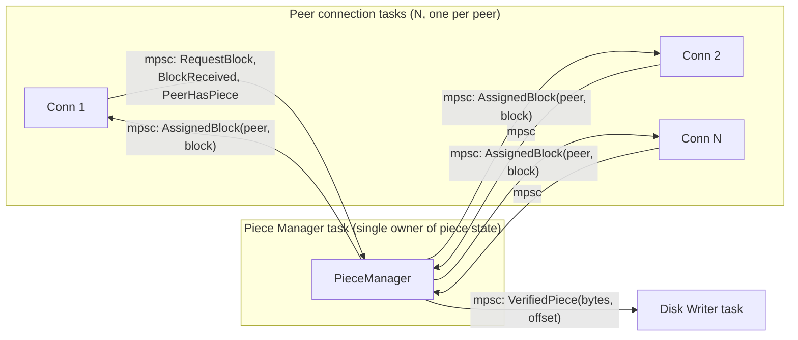
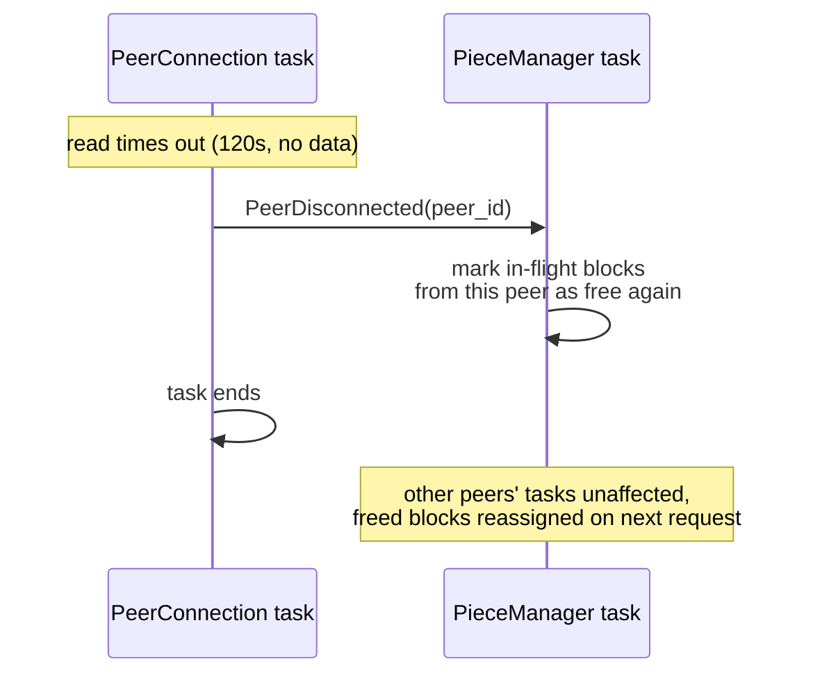

# Concurrency Model

Rust forces this decision explicitly — you cannot casually share mutable state across threads/tasks without going through `Arc<Mutex<_>>`, a channel, or an actor pattern. Planning this up front avoids fighting the borrow checker mid-implementation.

## The chosen model: async tasks + message passing, one shared-state manager

- **Runtime:** [Tokio](https://tokio.rs/), multi-threaded.
- **One async task per `PeerConnection`.** Each owns its TCP socket exclusively — no shared mutable socket state, so no lock needed there.
- **`PieceManager` is the one piece of genuinely shared state.** Rather than wrapping it in `Arc<Mutex<PieceManager>>` and having every `PeerConnection` task lock it directly (which works, but couples every task to the manager's internal structure and invites lock contention/deadlock as it grows), we run it as its **own task** and talk to it via `tokio::sync::mpsc` channels — the actor pattern. (The alternatives table in [System Architecture](./04-architecture.md) records why the `Mutex` option was rejected specifically.)



Why an actor instead of `Arc<Mutex<>>` here specifically: piece selection logic (rarest-first, endgame mode, re-requesting on timeout) is non-trivial and benefits from being single-threaded, sequential, and easy to reason about — exactly what an actor gives you for free, since only the actor's own task ever touches its state. A `Mutex` would work too, but would spread "when do I hold the lock, and for how long" reasoning across every peer task instead of confining it to one place.

## The channel message shapes, concretely

The architecture chapter's `PieceManager` methods (`assign_block`, `on_block_received`, `on_peer_disconnected`) become an enum once it's an actor rather than a plain struct other tasks call directly — the actor only exposes itself through the messages it accepts and the replies it sends back over a `oneshot` channel per request:

```rust
pub enum ToPieceManager {
    PeerHasPiece { peer: PeerId, piece_index: u32 },
    ReadyForWork { peer: PeerId, reply: oneshot::Sender<Option<BlockId>> },
    BlockReceived { peer: PeerId, block: BlockId, data: Bytes },
    PeerDisconnected { peer: PeerId },
}

pub enum FromPieceManager {
    VerifiedPiece { index: u32, data: Bytes },
}
```

Two details worth calling out because they're easy to get wrong on a first pass:

- `ReadyForWork` carries a `oneshot::Sender` for the reply, not a separate "poll for my assignment" message — this keeps the request/response pairing explicit and avoids the actor having to remember which peer asked what.
- Every inbound variant carries `peer: PeerId` (per the gap caught in [Data Flow](./07-data-flow.md) scenario 2) — without it, `PeerDisconnected` couldn't tell the actor *whose* in-flight blocks to free.

## What's a task vs. what's just a `struct` and a `match`

| Concept | Concurrency treatment | Why |
|---|---|---|
| Each `PeerConnection` | own Tokio task | owns a real OS resource (socket), long-lived, does blocking-ish I/O (`read`/`write`) that must not stall other peers |
| `PieceManager` | own Tokio task (actor) | genuinely shared, non-trivial internal logic, benefits from single-threaded reasoning |
| Tracker re-announce loop | own Tokio task (usually just one, periodic) | long-lived timer + occasional HTTP call, independent of peer traffic |
| Disk writes | own Tokio task, or `spawn_blocking` for the actual file I/O | file I/O can block; isolate it from the async peer-handling tasks so a slow disk doesn't stall network reads |
| Bencode parsing | plain function call, no task | short-lived, CPU-bound, no I/O — a task would just add overhead |
| The four choke/interest flags per peer | plain fields on that peer's own task-local state | only that `PeerConnection` task ever reads/writes them — no sharing, no sync needed |

## Sizing the channels and the connection pool

Numbers, not just shapes, are part of the concurrency plan — vague "some bounded channel" leaves the actual failure mode (backpressure vs. unbounded memory growth) undecided until it's a production incident:

- **Peer → PieceManager channel:** bounded at, say, 256 messages per peer-side sender clone (or one shared bounded channel of a few thousand, tagged with `peer_id`). Sized so a burst of `BlockReceived` messages from several fast peers can queue briefly without the actor falling permanently behind, but small enough that a stuck actor becomes visible (senders start blocking) rather than invisible (memory grows silently).
- **Max concurrent peer connections:** a configurable cap, defaulting to something like 50 (matching NF1's target) — enforced by `PeerManager`, not by the OS running out of file descriptors as a de facto limit.
- **Per-connection read/write timeout:** 120 seconds of no data — long enough to tolerate a genuinely slow-but-alive peer, short enough that a dead peer's blocks get freed for reassignment in reasonable time.

## Backpressure and the "one slow peer" problem (NF2 from requirements)

A misbehaving or slow peer must not stall the whole client. Concretely:

- Reads/writes to each peer socket use the per-connection timeout above.
- The `mpsc` channels between `PeerConnection` tasks and the `PieceManager` are **bounded**, so a burst from one peer can't unboundedly grow memory, but the `PieceManager`'s own loop must never block on a *specific* peer's channel in a way that stalls processing for others — use `select!` over all inbound channels, or a single combined inbound channel with the peer's id attached to each message (the approach the `ToPieceManager` enum above assumes).
- Dropping a peer is just: abort/let its task end, remove its entry from the swarm table, and re-issue any of its in-flight block requests to someone else via the `PieceManager`.



## What happens if the actor itself panics

An actor pattern concentrates piece logic in one task — which also means that task is a single point of failure if it panics on bad internal logic (as opposed to bad peer input, which is handled by returning `Result` rather than panicking, per [Risk Analysis](./10-risks.md)). Two concrete mitigations worth deciding now rather than after an incident:

- Wrap the actor's message loop body such that a panic on one message (e.g. an unexpected internal invariant violation) doesn't necessarily have to take the whole task down uncaught — `std::panic::catch_unwind` around per-message handling is a defensible choice here, logged loudly, since "one weird message crashes the whole download" is worse than "one weird message is dropped with a log line."
- If the actor task does die anyway, every peer task's `send` to it will start failing — that's the detectable signal to trigger a clean process-level shutdown with a clear error message, rather than peer tasks silently spinning or hanging on a channel nobody will ever read from again.
