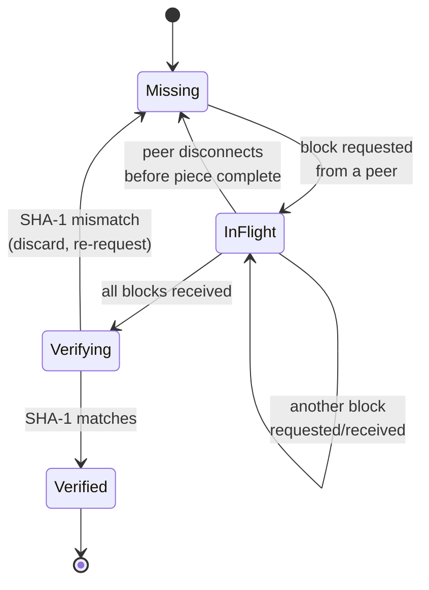
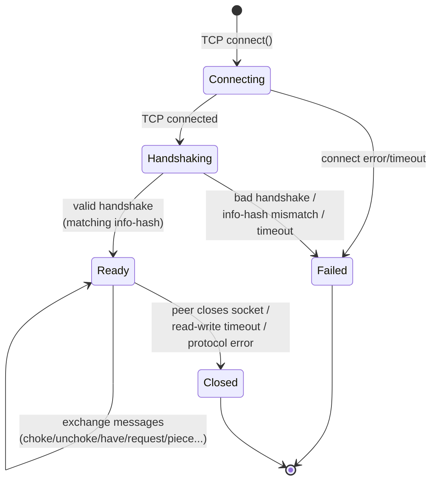

# State Machines

Any entity with a lifecycle deserves a state diagram *before* you write the code that mutates it. Two entities qualify here: a **Piece**, and a **PeerConnection**.

## Piece state machine



Notes:

- `Verifying → Missing` on hash mismatch matters: a corrupt or malicious peer can send bad data for a block. The plan must treat this as an expected, handled transition, not an error path bolted on later.
- `InFlight → Missing` on peer disconnect is what makes the "one slow peer doesn't stall the swarm" property (see [Concurrency Model](./05-concurrency.md)) actually correct — without this transition, a piece could get stuck forever waiting on a peer that's gone.

As a Rust enum, this maps directly onto the sketch from [Domain Model](./03-domain-model.md):

```rust
pub enum PieceState {
    Missing,
    InFlight { blocks: Vec<Option<Bytes>> },
    Verifying { blocks: Vec<Bytes> },   // transient — collapsed to Missing or Verified same tick
    Verified,
}
```

`Verifying` is drawn as its own diagram state because it clarifies *when* the hash check happens, but in code it's often collapsed into a single synchronous step inside the `InFlight → *` transition, since nothing else can observe a piece "mid-verification" — no other task acts on a piece between "last block arrived" and "hash checked." Writing it as an explicit diagram state and then consciously choosing to collapse it in code is a good sign: it means the collapse was a deliberate implementation simplification, not an accidental omission of a state nobody thought about.

## PeerConnection state machine

Recall from [Domain Model](./03-domain-model.md) that there are four independent flags. The diagram below tracks the **connection lifecycle** itself; the choke/interest flags are orthogonal state that exists once you're in `Ready`.



Within `Ready`, each side tracks two independent booleans — `am_choking` / `am_interested` — mirrored by the peer's own `peer_choking` / `peer_interested` as reported via `choke`/`unchoke`/`interested`/`not interested` messages. The rule that makes the protocol work: **you may only send `request` messages for blocks while the peer is not choking you AND you have declared interest.** Encode this as a guard, not a comment — e.g. don't expose a `send_request()` method at all unless the connection's typestate says unchoked-and-interested. That's the Rust type system doing planning enforcement for you.

## The four flags as their own tiny state machine

Because the four flags are independent but not *unrelated* — the "can I request?" rule depends on two of them jointly — it's worth a small table mapping every wire message to exactly which flag(s) it flips, so the mapping is decided once rather than re-derived at each call site:

| Wire message received | Flag flipped | New value |
|---|---|---|
| `choke` | `peer_choking` | `true` |
| `unchoke` | `peer_choking` | `false` |
| `interested` | `peer_interested` | `true` |
| `not interested` | `peer_interested` | `false` |

And the two flags *we* control, changed by our own logic rather than an incoming message:

| Local decision | Flag flipped | When |
|---|---|---|
| We want blocks from this peer | `am_interested` → `true`, send `interested` | peer's bitfield/have shows a piece we need |
| We have no more use for this peer right now | `am_interested` → `false`, send `not interested` | we've downloaded everything this peer has that we need |
| Choking algorithm decides to unchoke this peer | `am_choking` → `false`, send `unchoke` | (v1: simple — unchoke peers who are interested in us, up to a cap; a real tit-for-tat algorithm is a later refinement, not required for the non-goals-respecting v1 scope) |

`send_request(block)` is only callable when `!peer_choking && am_interested` — this guard is the single most important correctness rule in the whole peer wire protocol implementation, and it's worth encoding as a typestate (a `ReadyToRequest` wrapper type only constructible when both conditions hold) rather than a runtime `if` scattered across call sites, precisely because a forgotten `if` here produces a protocol violation a real peer may silently ignore or disconnect over — a bug that's hard to notice without deliberately testing for it.

## Why this chapter comes before "Data Flow"

You can't correctly draw a sequence diagram of "peer sends us a piece" until you know precisely which states permit that message to be meaningful. Getting the ordering questions ("could we receive `piece` after we sent `not interested`? do we still accept it?") answered here means the data-flow diagrams in the next chapter aren't guessing. (Answer, incidentally: yes — a peer may have already sent data for a request issued before our `not interested`; the wire protocol allows this race, and a robust client accepts and stores such a block rather than treating it as a protocol violation.)
