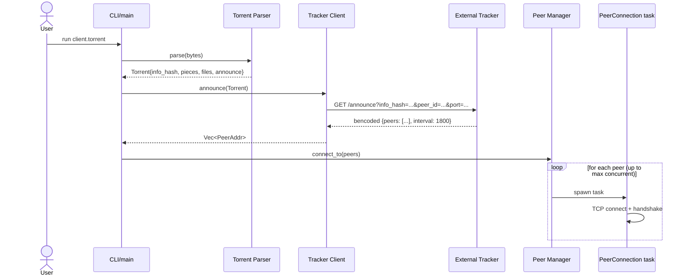
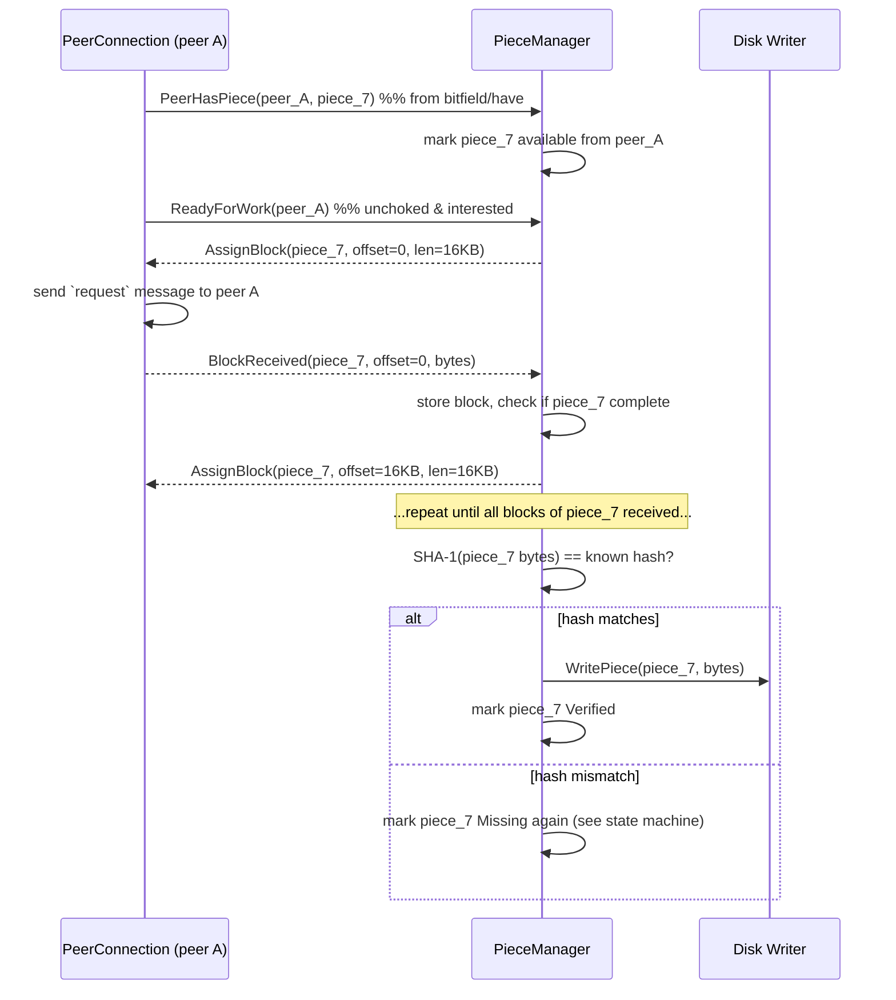
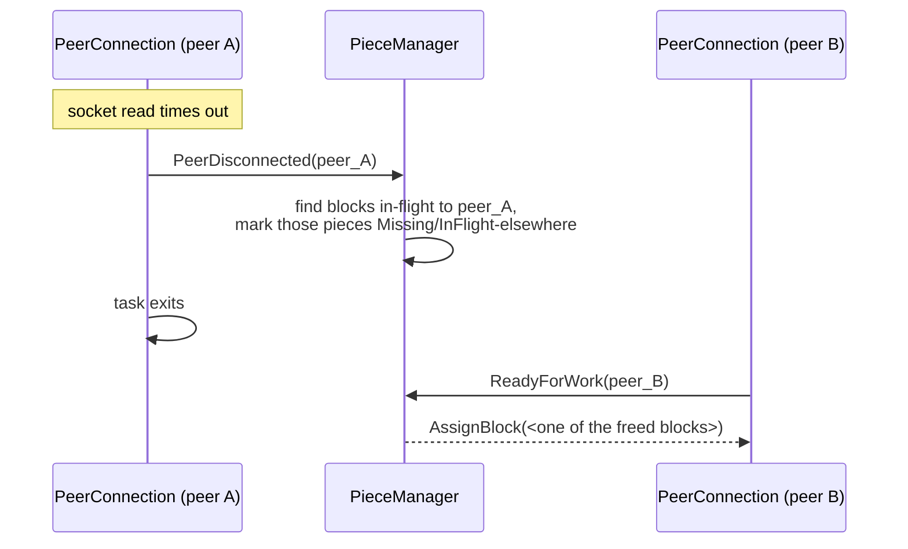
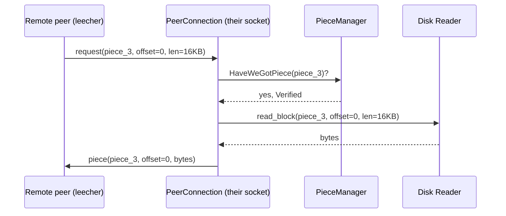

# Data Flow

Pick the scenarios that matter most and trace them end to end through the architecture. This is where architectural gaps get caught — if you can't draw the arrow, the box on either end is wrong or missing.

## Scenario 1: Startup, from `.torrent` file to first peer connection

Gap this catches: without drawing this, it's easy to forget that the tracker response's `interval` field means we must **re-announce periodically**, not just once at startup — that requirement wasn't obvious from the architecture diagram alone. A re-announce loop (its own long-lived Tokio task, per [Concurrency Model](./05-concurrency.md)) fires every `interval` seconds and also on completion (`event=completed`) and shutdown (`event=stopped`), per the tracker protocol's `event` field from F2.

## Scenario 2: Downloading and verifying one piece

Gap this catches: `PieceManager` needs to know not just "give me a block" but **which peer is asking**, so that on failure/disconnect it can reassign only that peer's in-flight blocks — this pushes `peer_id` into the channel message shapes decided in [Concurrency Model](./05-concurrency.md).

## Scenario 3: Peer disconnects mid-download

This is the data-flow proof that the resilience requirement (NF2) is actually satisfiable with the architecture and state machines as designed — not just asserted in prose.

## Scenario 4: Serving a piece back to a peer (seeding, F11)

Seeding is the *mirror image* of scenario 2 — tracing it catches whether `PeerConnection` and `PieceManager` can handle both directions of the same relationship without a redesign:

Gap this catches: the `Disk Writer` box from [System Architecture](./04-architecture.md) needs a *read* path, not just a write path — "Disk Writer" was named for its v1 responsibility, but once F11 is in scope it's really a `Disk` component with both `write_piece` and `read_block`. Renaming it (or explicitly splitting into `DiskWriter`/`DiskReader`) is a small architecture-doc revision surfaced only by tracing this scenario — exactly the "revise" loop described in [The Planning Pipeline](../part1/pipeline.md).

## A gap worth naming without a full diagram: endgame mode

Near the end of a download, only a few pieces remain, each potentially in-flight to a single slow peer — the classic "last piece takes forever" problem. A real client's fix (**endgame mode**: once few enough blocks remain, request the same block from multiple peers simultaneously and cancel the losers) is explicitly **not required for v1** per the non-goals in [Requirements & Scope](./02-requirements.md). It's called out here, in data flow, rather than silently ignored, because tracing scenario 2 is what makes the "last-piece-slow-peer" failure mode visible in the first place — the value of drawing the diagram is noticing the gap, even when the deliberate decision is to defer it.

## What tracing data flow told us that the architecture diagram didn't

Notice `PeerManager` barely appears in these sequences after startup — its job is connection lifecycle, not data flow, which confirms the architecture chapter's claim that it "does not itself speak the wire protocol." If it *had* shown up needing to route piece data, that would be a sign the architecture diagram drew the wrong boundary — this is the "revise" loop from [The Planning Pipeline](../part1/pipeline.md) in action.
