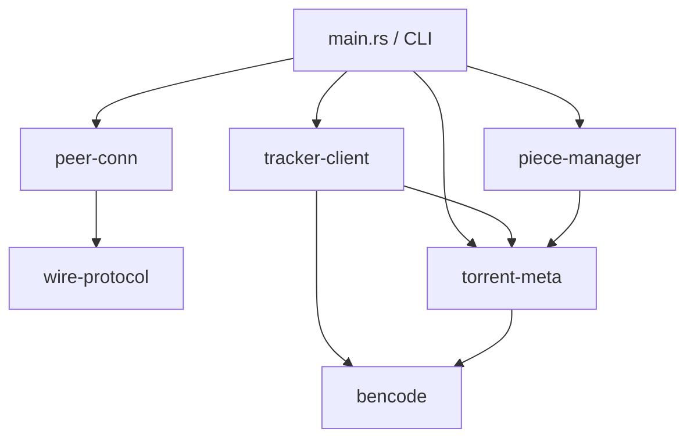

# Crate & Module Layout

Only now — after architecture, concurrency, state machines, and data flow are settled — do we map concepts onto actual Rust crates/modules. Doing this earlier tends to cause churn as the architecture shifts.

## Workspace layout

A Cargo workspace with a few crates keeps concerns separable and testable in isolation, without over-engineering into a dozen micro-crates:

```
torrent-client/
├── Cargo.toml                # workspace root
├── crates/
│   ├── bencode/               # bencode encode/decode — no I/O, pure data
│   │   └── src/lib.rs
│   ├── torrent-meta/           # .torrent parsing → Torrent struct (uses bencode)
│   │   └── src/lib.rs
│   ├── wire-protocol/          # peer wire message encode/decode — no I/O, pure data
│   │   └── src/lib.rs
│   ├── tracker-client/         # HTTP announce logic (uses bencode, torrent-meta)
│   │   └── src/lib.rs
│   ├── piece-manager/          # PieceManager actor + piece/block state machine
│   │   └── src/lib.rs
│   └── peer-conn/              # PeerConnection task (uses wire-protocol)
│       └── src/lib.rs
└── src/
    └── main.rs                 # CLI: wires everything together, owns the Tokio runtime
```



## Why split it this way

- **`bencode` and `wire-protocol` are pure, no-I/O crates.** They parse/serialize bytes to typed Rust values and back — nothing else. This makes them trivially unit-testable with plain byte fixtures, no network or filesystem mocking needed. This split pays for itself immediately in [Testing Strategy](./11-testing.md).
- **`torrent-meta` depends only on `bencode`**, not on networking — so parsing a `.torrent` file can be tested with zero async runtime involved.
- **`tracker-client` and `peer-conn` are the only crates that touch the network**, and they're separated from each other because they speak two unrelated protocols (HTTP announce vs. the peer wire protocol over raw TCP) — no reason to couple them.
- **`piece-manager` depends on `torrent-meta`** (needs piece hashes/lengths) but not on networking types — it reasons about pieces/blocks/verification only, taking peer identity as an opaque id, not a live connection. This keeps its unit tests free of any Tokio runtime too.
- **`main.rs` is the only place that wires concurrency together** (spawns tasks, creates channels) — every other crate is agnostic to *how* it's driven, which also means each crate stays reusable if a future GUI front-end were ever added (still a non-goal per scope, but the layout doesn't accidentally block it).

## Workspace `Cargo.toml` and dependency choices

Deciding *which crates from the ecosystem* to lean on is itself a planning decision — each one is a commitment that should be deliberate, not accidental:

```toml
# Cargo.toml (workspace root)
[workspace]
members = ["crates/*"]
resolver = "2"

[workspace.dependencies]
tokio = { version = "1", features = ["full"] }
bytes = "1"
sha1 = "0.10"
serde = { version = "1", features = ["derive"] }
reqwest = { version = "0.12", features = ["blocking"] }  # tracker-client only
thiserror = "1"
anyhow = "1"   # main.rs / CLI only — libraries should prefer typed errors
```

| Crate dependency | Used by | Why this one, not an alternative |
|---|---|---|
| `tokio` (full features) | everything async | matches the concurrency model's choice of runtime; "full" is acceptable at this scale, trim features later only if binary size becomes a concern (it isn't a stated requirement) |
| `bytes` | `piece-manager`, `peer-conn` | cheap, reference-counted byte buffers avoid copying 16KB blocks repeatedly between the channel boundary and disk |
| `sha1` | `piece-manager` | needed for F8 (piece verification) — a well-audited, minimal crate is preferable to hand-rolling SHA-1 |
| `reqwest` | `tracker-client` only | HTTP client for the tracker announce (F2); scoped to one crate so no other crate accidentally gains an HTTP dependency |
| `thiserror` | library crates (`bencode`, `wire-protocol`, `torrent-meta`, `piece-manager`, `tracker-client`, `peer-conn`) | typed, matchable errors at library boundaries — callers (including `main.rs`) can distinguish "bad handshake" from "socket closed" |
| `anyhow` | `main.rs` only | acceptable for a CLI's top-level error reporting where you just want to print and exit; never used inside library crates, where losing the error's type would hide information from callers |

## A general heuristic

> Put I/O-touching code and pure-logic code in different modules/crates, always. Pure logic is where most of your bugs and most of your tests live; I/O is where most of your flakiness lives. Don't let them share a compilation unit if you can help it — it's the difference between a unit test and an integration test, and you want far more of the former.

> A second heuristic, just as reusable: **scope third-party dependencies to the one crate that needs them.** If `reqwest` leaks into `piece-manager`, that's a sign a responsibility crossed a boundary it shouldn't have — the dependency graph is a cheap, automatically-checkable proxy for whether the architecture's boundaries are actually being respected in code, not just on paper.
