# Milestones & Sequencing

Order work into **vertical slices** — each milestone should be runnable and demoable, not "50% of one layer." This is the plan that turns directly into `PROGRESS.md` in Part III.

```mermaid
gantt
    title Torrent Client — Milestone Sequence
    dateFormat  X
    axisFormat %s
    section M0
    Bencode parser + unit tests           :m0, 0, 2
    section M1
    Parse real .torrent files             :m1, after m0, 2
    section M2
    Tracker HTTP announce (single peer)   :m2, after m1, 2
    section M3
    Peer handshake + wire messages        :m3, after m2, 3
    section M4
    Single-peer sequential download       :m4, after m3, 3
    section M5
    Piece verification + disk assembly    :m5, after m4, 2
    section M6
    Multi-peer concurrent download        :m6, after m5, 3
    section M7
    Rarest-first + resilience (NF2)       :m7, after m6, 3
    section M8
    Basic seeding (F11)                   :m8, after m7, 2
```

## Milestone details

Each milestone has a **demo** (what you show) and an **exit criterion** (the specific, checkable condition that means it's actually done, not just "looks like it works") — the exit criterion is what gets checked off in `PROGRESS.md`.

- **M0 — Bencode.** Pure encode/decode of bencoded values (integers, strings, lists, dicts). No torrent-specific logic yet.
  *Demo:* round-trip a handful of hand-written bencode fixtures in a unit test.
  *Exit criterion:* every bencode type round-trips byte-for-byte, and at least 5 malformed-input cases return `Err` without panicking.
- **M1 — `.torrent` parsing.** Build `torrent-meta` on top of M0: extract info-hash, piece hashes, piece length, file layout.
  *Demo:* run against a handful of real `.torrent` files (e.g. Linux ISO torrents, which have permissive trackers) and print the parsed metadata.
  *Exit criterion:* computed info-hash matches the known-good published value for at least 3 real torrents, including one multi-file torrent.
- **M2 — Tracker announce.** Send the HTTP GET, parse the bencoded peer list response.
  *Demo:* print a real list of peer IPs for a real torrent.
  *Exit criterion:* both compact and dictionary peer-list formats parse correctly (F2's acceptance criterion).
- **M3 — Peer wire protocol basics.** Handshake with one real peer, exchange `bitfield`/`have`, log the messages.
  *Demo:* connect to one peer from M2's list and print its piece bitfield.
  *Exit criterion:* handshake succeeds against at least one real peer, and a deliberately mismatched info-hash is correctly rejected in a unit/integration test.
- **M4 — Single-peer sequential download.** Request and receive blocks from exactly one peer, piece by piece, no verification yet.
  *Demo:* download a small torrent from one peer, badly, but completely.
  *Exit criterion:* all bytes for a small single-file torrent are received from one peer (verification arrives next milestone, so this criterion is about completeness, not correctness of content).
- **M5 — Verification + disk assembly.** Add SHA-1 checking and correct file writing (including multi-file torrents).
  *Demo:* download a real small torrent and diff the output against the known-good file.
  *Exit criterion:* downloaded file is byte-identical (`diff`/checksum match) to the known-good original, for both a single-file and a multi-file torrent whose piece boundaries straddle a file boundary.
- **M6 — Multi-peer concurrency.** Introduce the `PieceManager` actor and multiple `PeerConnection` tasks per [Concurrency Model](./05-concurrency.md).
  *Demo:* download noticeably faster with 5+ peers than with 1.
  *Exit criterion:* measured aggregate throughput with 5+ peers exceeds single-peer throughput from M4/M5 on the same torrent (F7's acceptance criterion).
- **M7 — Rarest-first + resilience.** Smarter piece selection, peer timeout/disconnect handling per the state machines.
  *Demo:* download completes even when peers are killed mid-transfer (test by force-closing connections).
  *Exit criterion:* forcibly killing a peer connection mid-download never crashes the process or stalls the remaining pieces past the timeout window (NF2's acceptance criterion, tested, not just argued).
- **M8 — Basic seeding.** Serve `request`s for pieces we already have.
  *Demo:* two instances of our own client seed to each other.
  *Exit criterion:* a fresh second instance can complete a full download using only a first, already-complete instance as its sole peer (F11's acceptance criterion).

## Sequencing rules used here

1. **Pure logic before I/O** (M0 before M1, wire message types before live sockets) — matches the module-layout heuristic from the previous chapter, and lets you unit-test the hardest-to-get-right parsing code before any network flakiness enters the picture.
2. **One peer before many peers** (M4 before M6) — get the sequential happy path fully correct before adding concurrency, so that when something breaks in M6 you know it's a concurrency bug, not a protocol bug.
3. **Correctness (verification) before performance (concurrency/rarest-first)** — M5 before M6/M7, matching NF3 from [Requirements & Scope](./02-requirements.md).
4. **Resilience after the happy path, not before** — you cannot meaningfully test "peer disconnects mid-download" (M7) until there's a working multi-peer download (M6) to disconnect *from*.

Note what's absent: DHT, magnet links, encryption — consistent with the non-goals list. A milestone plan is also a scope-enforcement tool; if a milestone doesn't map to something in [Requirements & Scope](./02-requirements.md), that's worth questioning before starting it.

## What "blocked" looks like across milestones

Milestones are drawn sequentially in the Gantt chart above, but a couple of dependencies are worth being explicit about rather than assuming strict one-after-another:

- M2 (tracker) and M3 (peer wire protocol basics) don't strictly depend on each other's *internals* — both only need M1's `Torrent` struct — but M3 needs *real peer addresses* to test against, which in practice come from M2. They could be developed in parallel by two people with M2 mocked out for M3's tests, but for a solo learning project, sequential is simpler and the mock work isn't worth the overhead.
- M8 (seeding) only strictly needs M5 (verified pieces to serve) and M3 (wire protocol, since serving `request`s is part of it) — it doesn't need M6/M7's concurrency or resilience work to be demoable in a minimal form. It's sequenced last anyway because it's explicitly the lowest-priority "Could have" in the MoSCoW list from [Requirements & Scope](./02-requirements.md), not because of a hard technical dependency.
