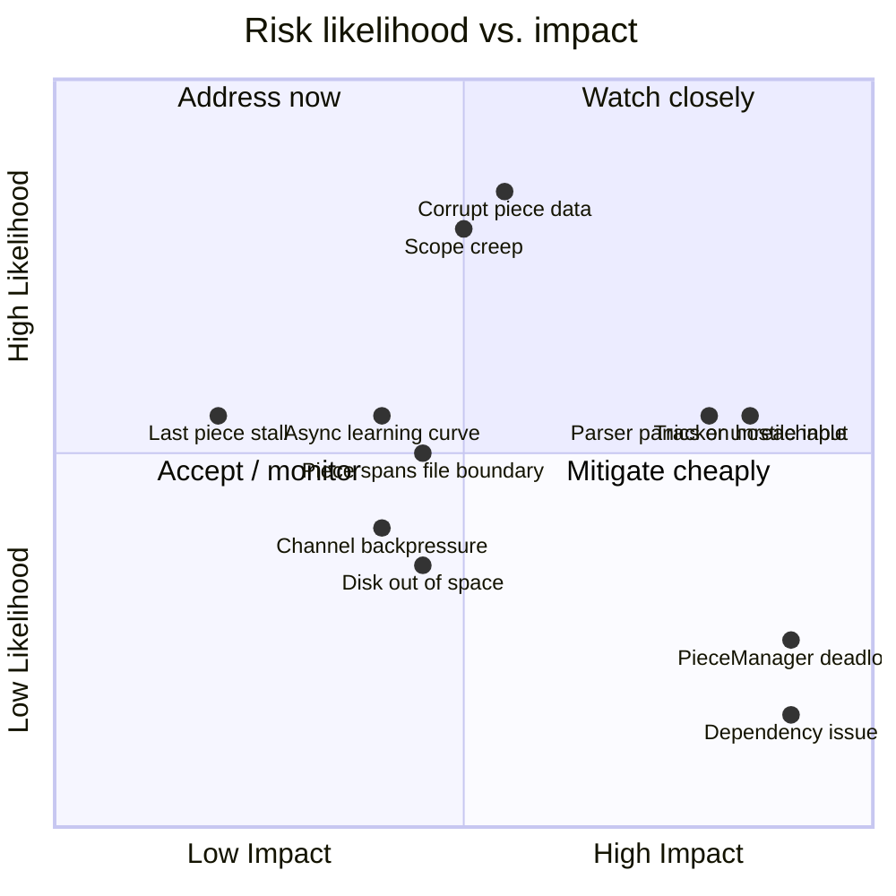

# Risk Analysis

Think about what's most likely to hurt before it happens, while it's still cheap to design around.

| Risk | Likelihood | Impact | Mitigation |
|---|---|---|---|
| Malicious/broken peer sends corrupt piece data | High (public swarms have bad actors) | Medium — bad file if unhandled | SHA-1 verification is mandatory (NF3), never skipped; failed pieces re-requested from a different peer |
| A peer is slow, not dead — timeout tuning is wrong | Medium | Medium — either drop good peers too eagerly, or stall on bad ones | Make timeout configurable; separate "slow" (deprioritize) from "dead" (drop) if it becomes an issue; start with a simple fixed timeout (M7) and revisit |
| Tracker is unreachable or returns few/no peers | Medium (depends on tracker health, out of our control) | High — nothing to do without peers | Support multiple announce URLs if present (`announce-list`); retry with backoff; this is a good place to *not* over-engineer for v1 — log and exit gracefully is an acceptable v1 behavior |
| Deadlock/contention in the `PieceManager` actor under high peer count | Low if actor pattern is followed correctly (see [Concurrency Model](./05-concurrency.md)) | High if it happens — whole download stalls | Keep `PieceManager`'s own loop non-blocking; never `.await` a peer-specific operation from inside its message loop without a timeout |
| Bencode/wire-protocol parser panics on malformed input from a hostile peer | Medium — swarms are adversarial by nature | High — a panic in a peer task shouldn't take down the whole process | Parsing functions return `Result`, never panic on untrusted input; each `PeerConnection` task's error is caught at the task boundary and only that task exits |
| Multi-file torrents: a piece spans a file boundary | Medium — common for real torrents with many small files | Medium — silent data corruption if mishandled | Cover this explicitly in the Disk Writer's design and in [Domain Model](./03-domain-model.md); write a unit test with a torrent whose piece boundaries deliberately straddle two files |
| Rust `async`/lifetime friction slows implementation (learning curve risk, not a design risk) | Medium if the author is new to async Rust | Medium — schedule slip, not correctness | Milestones M0–M3 deliberately front-load the async-heavy networking work early, so the learning curve is paid down before the more intricate piece-selection logic (M6/M7) |
| Scope creep: "let's just add DHT/magnet links" mid-project | High — this is the natural next thing every BitTorrent tutorial adds | Medium — derails milestone sequencing | Non-goals list in [Requirements & Scope](./02-requirements.md) exists specifically to be pointed at when this comes up; treat as a new project phase, not an addition to the current one |
| Bounded channel between peer tasks and `PieceManager` fills up under many fast peers | Low-Medium, more likely as peer count approaches NF1's 50-connection target | Medium — sending tasks stall briefly, throughput dips | Size channel capacity generously (see the concrete numbers in [Concurrency Model](./05-concurrency.md)); monitor for `send` backpressure in logs during M6/M7 testing before declaring it a non-issue |
| "Last piece" problem: download stalls near completion waiting on one slow peer for the final piece | Medium — a known, common real-world BitTorrent behavior | Low — annoying, not incorrect; download still completes eventually | Explicitly deferred: endgame mode (multi-requesting the last few blocks) is out of scope for v1, per [Data Flow](./07-data-flow.md); acceptable because it affects latency, not correctness |
| `reqwest`/HTTP or SHA-1 dependency has a supply-chain or correctness issue | Low | High if it happens — affects every torrent, silently | Pin dependency versions in `Cargo.toml` (per [Module Layout](./08-module-layout.md)); prefer well-audited, widely-used crates over novel ones; `cargo audit` as a periodic check, not necessarily CI-gated for a learning project |
| Disk runs out of space mid-download | Low-Medium, depends on torrent size vs. available disk | Medium — partial file, confusing failure if unhandled | Check available space against `Torrent`'s total file length before starting (a cheap M5-era addition); treat a write failure as fatal for that download, not something to retry silently |

## Reading this table

Likelihood and impact are estimates, not measurements — the value of writing them down isn't precision, it's forcing a deliberate ranking so effort isn't spent uniformly across all risks. Notice the mitigation column consistently points back to earlier chapters (state machines, concurrency model, non-goals) rather than inventing new mechanisms — that's a sign the earlier planning was doing its job. A risk whose mitigation requires a brand-new mechanism not covered anywhere else in the plan is a signal that an earlier chapter needs revisiting (the "revise" loop from [The Planning Pipeline](../part1/pipeline.md)).

## Visualizing the ranking: a quadrant chart

A `quadrantChart` (another Mermaid type, useful specifically for likelihood/impact-style rankings) makes the *relative* priority easier to see at a glance than scanning a table column by column — the top-right quadrant is where attention should concentrate first:

Reading the chart: **"Address now" (quadrant 2 — high impact, high likelihood)** is where corrupt piece data and scope creep land — both already have concrete mitigations built into earlier chapters (mandatory verification, the non-goals list) rather than left as open risks, which is exactly what you want a quadrant-2 item's mitigation to look like. Items drifting toward "Accept / monitor" (low likelihood, low-to-medium impact, like the last-piece stall) are correctly the ones explicitly deferred rather than engineered around.
