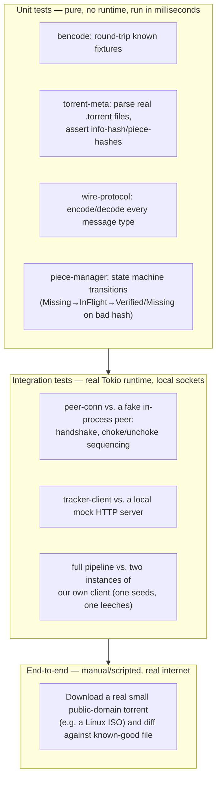

# Testing Strategy

How each layer from [Module Layout](./08-module-layout.md) gets verified — decided before implementation, so tests aren't an afterthought bolted onto whatever shape the code happened to take.



## Layer by layer

- **`bencode` / `wire-protocol` (pure crates)** — table-driven unit tests: known byte sequences in, known typed values out, and back. Include deliberately malformed input (truncated strings, negative lengths) and assert `Result::Err`, never a panic — this is where the "malicious peer" risk from [Risk Analysis](./10-risks.md) gets its first line of defense.
- **`torrent-meta`** — parse a handful of checked-in real `.torrent` files as fixtures; assert the computed info-hash matches a known value (info-hash is SHA-1 over a specific bencoded sub-dictionary — easy to get subtly wrong, so pin it with a real known-good hash).
- **`piece-manager`** — since it depends on no networking types (per the module layout decision), drive its state machine directly with fake peer ids and byte buffers: assert a piece transitions `Missing → InFlight → Verified` on correct hash, and `→ Missing` again on incorrect hash, and that disconnecting a peer frees its in-flight blocks. These tests should map almost one-to-one onto the diagrams in [State Machines](./06-state-machines.md) — if a transition in the diagram has no corresponding test, that's a gap.
- **`peer-conn`** — integration-test against a small fake peer implemented in the test itself (just enough of the wire protocol to be a convincing partner), run on a real Tokio runtime with real local TCP sockets. Confirms the handshake and choke/interest logic against real async I/O, without needing the public internet.
- **`tracker-client`** — integration-test against a local mock HTTP server (e.g. via a lightweight embedded server in the test) that returns a canned bencoded peer list.
- **Full pipeline** — the strongest integration test is two instances of our *own* client on localhost, one seeding a small file, one downloading it, asserting the downloaded bytes match. This exercises real concurrency, real verification, and real disk assembly without depending on the public swarm being available or well-behaved.
- **End-to-end (manual, not CI)** — periodically run against a real, well-seeded public-domain torrent and diff the result against the known file. This is the only stage touching the actual internet and untrusted peers, so it stays a manual/occasional check, not something CI runs on every commit.

## What the tests actually look like

Concrete sketches make "unit test the state machine" less abstract — these are the shape of tests that should exist by the end of M1 and M6/M7 respectively.

Bencode round-trip with malformed input, from `bencode`:

```rust
#[test]
fn decodes_known_dict() {
    let input = b"d3:cow3:moo4:spam4:eggse";
    let value = bencode::decode(input).unwrap();
    assert_eq!(value, Bencode::Dict(BTreeMap::from([
        ("cow".into(), Bencode::Str(b"moo".to_vec())),
        ("spam".into(), Bencode::Str(b"eggs".to_vec())),
    ])));
}

#[test]
fn rejects_truncated_string_length_without_panicking() {
    let input = b"99999:short"; // claims 99999 bytes, only has 5
    assert!(bencode::decode(input).is_err());
}

#[test]
fn rejects_negative_string_length_without_panicking() {
    let input = b"-1:x";
    assert!(bencode::decode(input).is_err());
}
```

`piece-manager` state-machine test, driven with no networking or Tokio runtime at all:

```rust
#[test]
fn piece_reverts_to_missing_on_hash_mismatch() {
    let mut mgr = PieceManager::new(fake_torrent_with_one_piece());
    let peer = PeerId::from([1u8; 20]);

    mgr.on_peer_has_piece(peer, 0);
    let block = mgr.assign_block(peer).expect("should assign the only piece's block");
    mgr.on_block_received(peer, block, Bytes::from_static(b"deliberately wrong bytes"));

    assert_eq!(mgr.piece_state(0), PieceState::Missing);
}

#[test]
fn disconnecting_a_peer_frees_its_in_flight_blocks() {
    let mut mgr = PieceManager::new(fake_torrent_with_one_piece());
    let peer = PeerId::from([1u8; 20]);

    mgr.on_peer_has_piece(peer, 0);
    let _block = mgr.assign_block(peer).unwrap();
    mgr.on_peer_disconnected(peer);

    // no one has the piece marked in-flight anymore, so a new peer can claim it
    let other = PeerId::from([2u8; 20]);
    mgr.on_peer_has_piece(other, 0);
    assert!(mgr.assign_block(other).is_some());
}
```

A local-swarm integration test, tying `peer-conn`, `piece-manager`, and disk I/O together without touching the public internet:

```rust
#[tokio::test]
async fn two_local_clients_seed_and_leech_a_small_file() {
    let (seed_dir, leech_dir) = (tempdir().unwrap(), tempdir().unwrap());
    write_known_file(&seed_dir, "hello.txt", b"hello, swarm!".repeat(1000));

    let torrent = make_torrent_for(&seed_dir, "hello.txt");
    let seeder = spawn_client(&torrent, &seed_dir, /* already has all pieces */ true).await;
    let leecher = spawn_client(&torrent, &leech_dir, false).await;

    leecher.connect_to(seeder.local_addr()).await;
    leecher.wait_until_complete(Duration::from_secs(10)).await
        .expect("download should complete from a single well-behaved peer");

    assert_eq!(
        read_file(&leech_dir, "hello.txt"),
        read_file(&seed_dir, "hello.txt"),
    );
}
```

## Coverage targets, roughly

Not a hard gate, but a guide to where effort should concentrate — matching the risk analysis's ranking rather than spreading test-writing effort evenly:

| Crate | Target | Why this level |
|---|---|---|
| `bencode`, `wire-protocol` | High (most branches, including malformed input) | Pure, fast, adversarial-input-facing — cheapest place to be thorough, and the first line of defense per [Risk Analysis](./10-risks.md) |
| `piece-manager` | High, especially state transitions | Every transition in [State Machines](./06-state-machines.md) should have a corresponding test; this is the crate correctness of the whole client hinges on most |
| `torrent-meta` | Medium-high | A handful of real-file fixtures covers most of the risk; exotic bencode edge cases are already `bencode`'s job |
| `tracker-client`, `peer-conn` | Medium, via integration tests | Harder to exhaustively unit test since they're I/O-bound; rely on integration tests against fakes/mocks rather than chasing high line-coverage numbers here |
| `main.rs` / CLI wiring | Low, covered mostly by the full-pipeline integration test | Thin wiring code; its correctness is best demonstrated by the system actually working end-to-end, not by unit-testing argument parsing exhaustively |

## Why this order (bottom of the pyramid gets built first)

This mirrors the milestone sequencing from [Milestones & Sequencing](./09-milestones.md) deliberately: M0/M1 (bencode, parsing) get unit tests immediately because they're pure and fast; the full-pipeline integration test only becomes possible once M6 (multi-peer) exists. Writing the testing strategy chapter alongside milestones — rather than as an afterthought — means each milestone's "demo" in the previous chapter and its corresponding test tier here were designed together.
