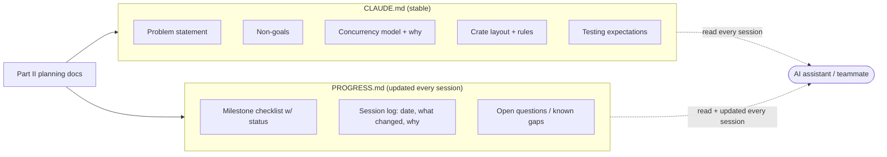

# Turning This Into CLAUDE.md and PROGRESS.md

Everything in Part II is a plan for a *human* to read. Two more artifacts turn it into something an AI coding assistant (or a new teammate) can pick up cold, session after session, without re-deriving decisions or drifting from them.

## `CLAUDE.md` — durable, rarely-changing instructions

`CLAUDE.md` (or `AGENTS.md`) is not a diary of what happened — it's the **standing context** a fresh agent session needs: the problem statement, the non-goals, the architectural decisions, and the constraints that must not be silently violated. It changes rarely — only when a real architectural decision changes.

What goes in, sourced directly from Part II:

- The one-paragraph problem statement ([Problem Framing](../part2/01-problem-framing.md)).
- The non-goals list verbatim ([Requirements & Scope](../part2/02-requirements.md)) — this is the single highest-value section, since it's what stops an agent from "helpfully" implementing DHT support unprompted.
- The chosen concurrency model and *why* ([Concurrency Model](../part2/05-concurrency.md)) — so an agent doesn't casually reach for `Arc<Mutex<PieceManager>>` when the actor pattern was a deliberate choice.
- The crate layout and the I/O/pure-logic split rule ([Module Layout](../part2/08-module-layout.md)).
- Testing expectations per layer ([Testing Strategy](../part2/11-testing.md)) — so an agent adding a feature knows which tier of test it owes.
- House rules: e.g. "never skip SHA-1 verification, even temporarily, even in a draft," "parsing functions return `Result`, never panic on untrusted input."

## `PROGRESS.md` — the living log

Where `CLAUDE.md` is stable, `PROGRESS.md` changes every session. It's the milestone plan from [Milestones & Sequencing](../part2/09-milestones.md) with a status column, plus a short running log of what actually happened — including deviations from the plan and why.



## Suggested content

`CLAUDE.md`:

```markdown
# torrent-client

## What this is
Rust BitTorrent client (client only — trackers already exist, out of scope).
See full plan: https://<this-book>.

## Non-goals (do not implement without discussing first)
- DHT / trackerless torrents
- Magnet links
- GUI
- uTP
- Peer encryption (MSE/PE)
- Bandwidth throttling

## Architecture rules
- One Tokio task per PeerConnection. PieceManager is a single actor task,
  reached only via mpsc channels — never wrap it in Arc<Mutex<_>>.
- bencode and wire-protocol crates: pure, no I/O, never panic on untrusted
  input — always return Result.
- piece-manager crate must not depend on any networking types.

## Non-negotiables
- SHA-1 verification of every piece, always. Never skip, even for debugging.
- Malformed/hostile peer input must produce Result::Err, not a panic.

## Testing expectations
- New parsing code: unit tests with fixtures, including malformed input.
- New PieceManager logic: state-machine tests (see book, State Machines
  chapter) — every transition in the diagram needs a test.
- New networking code: integration test against a fake/local peer first;
  only touch the real public swarm in manual/e2e checks.
```

`PROGRESS.md`:

```markdown
# Progress

## Milestones
- [x] M0 — Bencode parser + unit tests
- [x] M1 — Parse real .torrent files
- [ ] M2 — Tracker HTTP announce (in progress)
- [ ] M3 — Peer handshake + wire messages
- [ ] M4 — Single-peer sequential download
- [ ] M5 — Piece verification + disk assembly
- [ ] M6 — Multi-peer concurrent download
- [ ] M7 — Rarest-first + resilience
- [ ] M8 — Basic seeding

## Log
- 2026-07-21: M0/M1 done. Bencode crate has 12 unit tests incl. malformed
  input cases. torrent-meta verified against 3 real .torrent fixtures,
  info-hash matches known-good values.
- 2026-07-21: Starting M2. Note: chose reqwest (blocking-free, async) for
  the tracker HTTP client over a raw hyper client for simplicity — revisit
  only if we need UDP tracker support later (BEP 15), which is not planned.

## Open questions
- Peer timeout value (currently planned 2 min) — untuned, revisit after M7
  resilience testing.
```

## Why keep them as two separate files

Mixing "what will never change" with "what changed yesterday" produces a document nobody trusts — the stable rules get buried under a growing log, and eventually get silently violated because nobody scrolled far enough to see them. Splitting them means an agent can load `CLAUDE.md` once as near-permanent context, and treat `PROGRESS.md` as the one file it must re-read (and update) every session.
