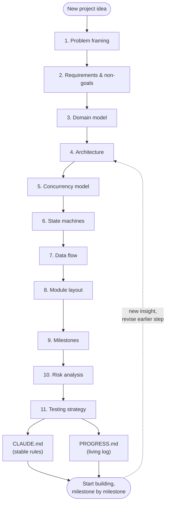

# Applying This Method To Your Own App

The torrent client was the vehicle; the method is what to keep. Here's the same eleven-step pipeline as a checklist template for your next project.

## The reusable template

For each step, ask the general question, and force yourself to write the answer down before moving to the next step:

1. **Problem framing** — Who has this problem? What do they do today? One paragraph, no design.
2. **Requirements & scope** — Must-do list. Non-functional constraints (perf/reliability/portability). **Explicit non-goals list** — this is the one most projects skip and regret.
3. **Domain model** — What are the nouns? Draw an `erDiagram`. Don't let "unit of storage" and "unit of transfer" collapse into one concept if the real system has two (piece vs. block was the torrent example; look for the equivalent in your domain — e.g. "order" vs. "line item," "document" vs. "chunk" in a RAG system).
4. **Architecture** — Boxes and arrows, `flowchart`. One paragraph per box: responsibility, and explicitly what it does *not* do.
5. **Concurrency model** — What's genuinely parallel? What's shared mutable state, and how is it synchronized — actor, lock, or immutable/message-passing? Pick deliberately, don't let the framework default you into it.
6. **State machines** — For every entity with a lifecycle, `stateDiagram-v2` before you write the mutating code.
7. **Data flow** — Your top 2-3 scenarios as `sequenceDiagram`s, end to end through the architecture. This is your gap-finder.
8. **Module/crate layout** — Map architecture onto real source structure now, not before. Separate pure logic from I/O wherever the language allows it.
9. **Milestones** — Vertical slices, each demoable. Order by: pure-before-I/O, one-instance-before-many, correctness-before-performance, happy-path-before-resilience.
10. **Risk analysis** — Table of risk/likelihood/impact/mitigation. Good mitigations point back at earlier chapters; if one requires an entirely new mechanism, revisit the earlier chapter.
11. **Testing strategy** — Map test tiers onto the module layout: unit tests for pure crates, integration tests for I/O boundaries against fakes/mocks, e2e for the real external world, run rarely and manually if that world is untrusted or unreliable.

## What transfers regardless of what you're building

- **The non-goals list is always worth writing**, whether it's DHT for a torrent client or "no multi-tenancy in v1" for a SaaS app.
- **The I/O vs. pure-logic split** for module layout and testing generalizes to almost every system: parsers, business rules, and state machines can usually be pure; network calls, disk, and databases can't.
- **"Long-lived stateful resource → its own task/thread; shared logic → a manager behind a queue or lock" is a concurrency heuristic**, not a torrent-specific one — the same reasoning applies to, say, one task per websocket connection with a shared matchmaking/session manager.
- **Diagrams-as-code next to the docs next to the code**, all in the same repo, all reviewed in the same PRs — keeps the plan from rotting, regardless of domain.
- **`CLAUDE.md` (stable) + `PROGRESS.md` (living)** is a general pattern for keeping any AI assistant, or any new hire, oriented without re-reading the whole git history.

## A closing note

The plan in Part II took longer to read than it would take to write a rough first draft of the torrent client's networking code. That's expected, and it's the trade this whole book argues for: the hours spent here are the cheapest hours in the entire project. Spend them.
